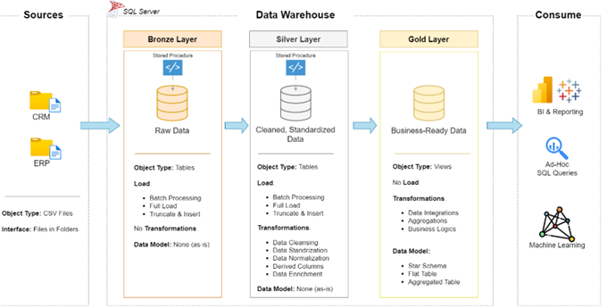
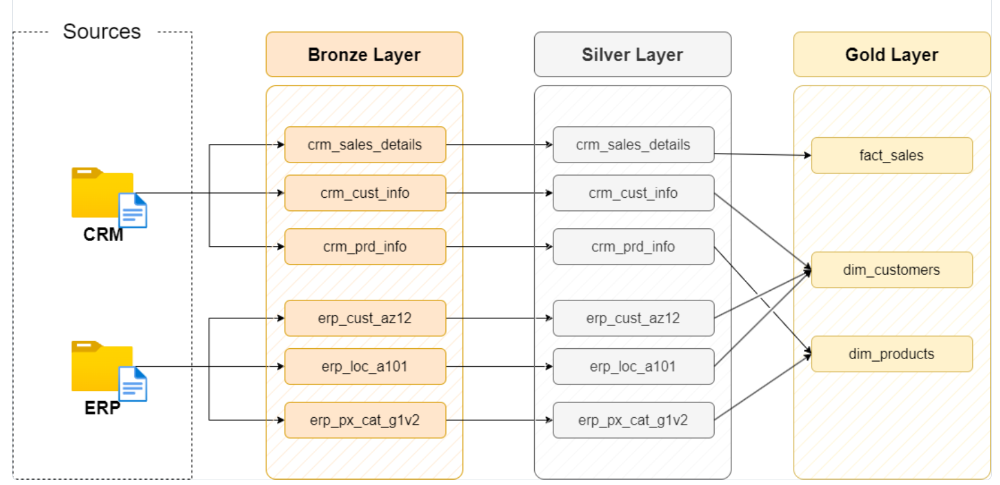
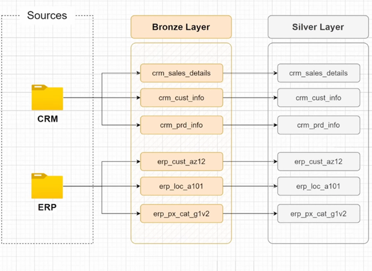
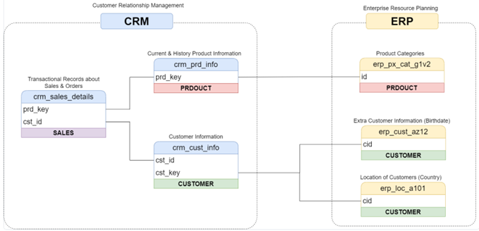
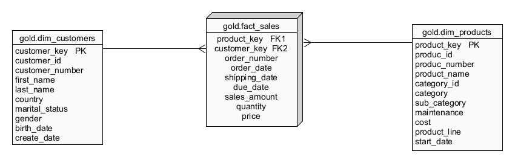

# 🏗️ SQL Data Warehouse Project


A production-style data warehouse built from scratch on **Microsoft SQL Server**, consolidating raw operational data from two source systems (CRM + ERP) into a unified, analytics-ready Star Schema — using a full **Medallion Architecture (Bronze → Silver → Gold)**.

This is my first personal data engineering project, built to understand the full pipeline from raw ingestion to business-ready reporting.

---

## 📌 Table of Contents

- [The Problem](#-the-problem)
- [Architecture Overview](#-architecture-overview)
- [Data Flow](#-data-flow)
- [Layer Breakdown](#-layer-breakdown)
  - [Bronze — Raw Ingestion](#-bronze-layer--raw-ingestion)
  - [Silver — Clean & Standardise](#-silver-layer--clean--standardise)
  - [Gold — Analytics Ready](#-gold-layer--analytics-ready)
- [Star Schema](#-star-schema)
- [Data Quality & Testing](#-data-quality--testing)
- [How to Run](#-how-to-run)
- [Project Structure](#-project-structure)
- [Naming Conventions](#-naming-conventions)
- [Lessons Learned](#-lessons-learned)
- [Future Improvements](#-future-improvements)

---

## 🎯 The Problem

Most businesses run multiple operational systems that don't talk to each other. In this project, customer data lives in a **CRM**, while demographic and geographic data sits in an **ERP**. Neither system is designed for analytics — and without a centralised, trusted data store, answering even a basic business question requires manual reconciliation across two sources with inconsistent formats.

**Goal:** Design and build a warehouse that:
- Unifies data from CRM + ERP into a single model
- Cleans and standardises every field so analysts can trust the output
- Delivers a Star Schema ready for direct BI tool connection — no further wrangling needed

---

## 🏛️ Architecture Overview

The warehouse follows the **Medallion Architecture** — a three-layer design where data gets progressively more refined at each stage.

docs/architecture-overview.png



| Layer | Schema | What Happens | Object Type |
|-------|--------|--------------|-------------|
| 🥉 **Bronze** | `bronze` | Raw data loaded exactly as-is from CSV files. No transformations. | Tables |
| 🥈 **Silver** | `silver` | Data cleaned, standardised, deduplicated, and validated. | Tables |
| 🥇 **Gold** | `gold` | Silver data joined and shaped into a Star Schema for analytics. | Views |

### Why Medallion and not something else?

| Architecture | Decision |
|---|---|
| **Inmon (EDW)** | ❌ Rejected — excessive complexity for single-domain project |
| **Kimball** | ⚠️ Partially adopted — Star Schema used in Gold, but Medallion adds raw data preservation |
| **Data Vault** | ❌ Rejected — Hubs/Links/Satellites over-engineering for this scope |
| **Data Mesh** | ❌ Rejected — designed for large multi-team orgs, not applicable here |

---

## 🔄 Data Flow

Data enters from two source systems as CSV files and travels through all three layers:



**Sources:**
| System | Tables |
|--------|--------|
| CRM | `cust_info`, `prd_info`, `sales_details` |
| ERP | `CUST_AZ12`, `LOC_A101`, `PX_CAT_G1V2` |

---

## 🔩 Layer Breakdown

### 🥉 Bronze Layer — Raw Ingestion

Six tables created in the `bronze` schema — one per source file. Data is loaded **exactly as received**, preserving every quirk and inconsistency from the source. This is the safety net: if any Silver transformation goes wrong, you re-examine Bronze without re-importing CSVs.

**Key implementation decisions:**
- All columns use `NVARCHAR` to prevent type conversion failures during load
- `BULK INSERT` with `TABLOCK` hint for performance
- Truncate-and-reload pattern — idempotent, simple, predictable
- Full `TRY/CATCH` error handling with console logging

```sql
-- Run to load all Bronze tables
EXEC bronze.load_bronze;
```

**Scripts:** `scripts/bronze_layer/create_table.sql` · `scripts/bronze_layer/load_data.sql`

---

### 🥈 Silver Layer — Clean & Standardise

The `silver.load_silver` stored procedure applies all transformations. Here's what was fixed and why:



#### `crm_cust_info` — Customer Records
| Problem | Fix | Why |
|---------|-----|-----|
| Names with leading/trailing spaces | `TRIM()` | Prevents broken joins and duplicate-looking records |
| Gender/marital status as single-letter codes | `CASE WHEN 'F' → 'FEMALE'`, `'S' → 'SINGLE'` | Readable, consistent values for reporting |
| Duplicate customer records | `ROW_NUMBER()` — keep most recent per `cst_id` | Each customer must appear exactly once |
| Rows with NULL customer ID | `WHERE cst_id IS NOT NULL` | Unidentifiable records have no place in a clean layer |

#### `crm_prd_info` — Product Catalogue
| Problem | Fix | Why |
|---------|-----|-----|
| Category ID embedded in product key as prefix | `SUBSTRING()` to split into `cat_id` + `prd_key` | Enables join to ERP category table in Gold |
| Product line as codes (M, R, T, S) | Map to full names: Mountain, Road, Touring, Other Sales | Human-readable without lookup tables |
| No end date for product versions | `LEAD()` — end date = next version start - 1 day | Correctly models product version history |
| NULL product costs | `ISNULL(prd_cost, 0)` | Prevents arithmetic failures in Gold |

#### `crm_sales_details` — Transactions
| Problem | Fix | Why |
|---------|-----|-----|
| Dates stored as 8-digit integers (e.g. `20130101`) | `CAST` chain: INT → VARCHAR → DATE, NULL for invalid | Enables date filtering and range queries |
| Sales amounts wrong, zero, or negative | Recalculate: `quantity × ABS(price)` when invalid | Accurate financial figures |
| NULL or negative prices | Derive: `sales / NULLIF(quantity, 0)` | Recover data instead of discarding rows |

#### `erp_cust_az12` — ERP Demographics
| Problem | Fix | Why |
|---------|-----|-----|
| Customer IDs with `NAS` prefix | `SUBSTRING()` to strip prefix | Matches CRM key format for join |
| Future birth dates | Set to `NULL` if `bdate > GETDATE()` | Future birth dates are invalid |
| Inconsistent gender values (F, Female, M, Male) | Normalise to `'Male'`, `'Female'`, `'N/A'` | Consistent grouping in analytics |

#### `erp_loc_a101` — Customer Locations
| Problem | Fix | Why |
|---------|-----|-----|
| Hyphens in customer IDs | `REPLACE(cid, '-', '')` | Aligns with CRM format for join |
| Inconsistent country codes (DE, US, USA) | Map to full names: Germany, United States | Readable geographic reporting |

#### `erp_px_cat_g1v2` — Product Categories
No transformations required — data quality confirmed clean during source analysis.

```sql
-- Run to load and transform all Silver tables
EXEC silver.load_silver;
```

**Scripts:** `scripts/silver_layer/create_table.sql` · `scripts/silver_layer/clean_load.sql`

---

### 🥇 Gold Layer — Analytics Ready

Three SQL **views** — no physical tables, no separate load step. The views always reflect the latest Silver data automatically.



**Scripts:** `scripts/gold_layer/ddl.sql`

---

## ⭐ Star Schema

The Gold layer implements a Star Schema — one central fact table surrounded by two dimension views.



### `gold.dim_customers`
Joins `crm_cust_info` + `erp_cust_az12` + `erp_loc_a101` into a complete customer profile.
- Surrogate key: `ROW_NUMBER() OVER (ORDER BY cst_id)`
- Gender logic: CRM is primary source; ERP used as fallback if CRM = `'N/A'`

| Column | Source |
|--------|--------|
| `customer_key` | Generated surrogate key |
| `customer_id`, `customer_number` | CRM |
| `first_name`, `last_name` | CRM — trimmed in Silver |
| `country` | ERP location — standardised in Silver |
| `marital_status`, `gender` | CRM primary, ERP fallback |
| `birth_date` | ERP — future dates nulled in Silver |
| `create_date` | CRM |

### `gold.dim_products`
Joins `crm_prd_info` + `erp_px_cat_g1v2` on `cat_id`. Filters `WHERE prd_end_dt IS NULL` — current products only.
- Surrogate key: `ROW_NUMBER() OVER (ORDER BY prd_start_dt, prd_key)`

| Column | Source |
|--------|--------|
| `product_key` | Generated surrogate key |
| `product_id`, `product_number` | CRM — key cleaned in Silver |
| `product_name` | CRM |
| `category`, `sub_category`, `maintenance` | ERP hierarchy |
| `product_cost` | CRM — NULLs → 0 in Silver |
| `product_line` | CRM — codes expanded in Silver |
| `start_date` | CRM |

### `gold.fact_sales`
One row per sales transaction line. Resolves customer and product references via surrogate keys.

| Column | Description |
|--------|-------------|
| `order_number` | Unique order identifier |
| `product_key` | FK → `dim_products` |
| `customer_key` | FK → `dim_customers` |
| `order_date`, `shipping_date`, `due_date` | Dates — integers converted in Silver |
| `sales_amount` | Recalculated in Silver if original was invalid |
| `quantity`, `price` | Derived in Silver if original was invalid |

---

## ✅ Data Quality & Testing

> Every check is a query that should return **zero rows** if everything is correct.

### Silver Layer Checks
`test_runs/silver_layer_quality_checks.sql`

- No duplicate or NULL customer IDs
- No unwanted spaces in string fields
- Gender and marital status only contain expected values
- No negative or NULL product costs
- Product end date never before start date
- Sales date values are valid (no zeros, wrong-length integers, out-of-range values)
- `sales_amount = quantity × price` for all rows
- No future birth dates
- Country values are fully standardised

### Gold Layer Checks
`test_runs/gold_layer_quality_checks.sql`

- No duplicate surrogate keys in `dim_customers`
- No duplicate surrogate keys in `dim_products`
- All `fact_sales` rows resolve to a valid customer and product (referential integrity)

---

## 🚀 How to Run

> ⚠️ Step 1 **drops and recreates** the entire database. Always back up first.

| Step | Script / Command | What it does |
|------|-----------------|--------------|
| 1 | `scripts/database.sql` | Creates `DataWarehouse` database + 3 schemas |
| 2 | `scripts/bronze_layer/create_table.sql` | Creates all 6 Bronze tables |
| 3 | `EXEC bronze.load_bronze` | Bulk-loads CSV source files into Bronze |
| 4 | `scripts/silver_layer/create_table.sql` | Creates all 6 Silver tables |
| 5 | `EXEC silver.load_silver` | Cleans and loads Bronze → Silver |
| 6 | `scripts/gold_layer/ddl.sql` | Creates Gold views |
| 7 *(optional)* | `test_runs/` quality checks | Validates Silver and Gold integrity |

> **Before running Step 3:** Update the absolute file paths in `scripts/bronze_layer/load_data.sql` to match your local directory.

---

## 📁 Project Structure

```
sql-data-warehouse-project/
│
├── datasets/
│   ├── source_crm/          # CRM source CSV files
│   └── source_erp/          # ERP source CSV files
│
├── docs/
│   ├── Data-flow.png        # End-to-end data flow diagram
│   ├── star-schema.png      # Gold layer Star Schema ERD
│   └── data_catalog.md      # Full column-level data catalog
│
├── scripts/
│   ├── database.sql         # Database + schema creation
│   ├── bronze_layer/
│   │   ├── create_table.sql # Bronze DDL
│   │   └── load_data.sql    # Bronze load stored procedure
│   ├── silver_layer/
│   │   ├── create_table.sql # Silver DDL
│   │   └── clean_load.sql   # Silver ETL stored procedure
│   └── gold_layer/
│       └── ddl.sql          # Gold view definitions
│
└── test_runs/
    ├── silver_layer_quality_checks.sql
    └── gold_layer_quality_checks.sql
```

---

## 📐 Naming Conventions

| Scope | Convention | Example |
|-------|-----------|---------|
| General | `snake_case`, English only | — |
| Bronze/Silver tables | `<sourcesystem>_<entity>` | `crm_cust_info`, `erp_loc_a101` |
| Gold tables | `<category>_<entity>` | `dim_customers`, `fact_sales` |
| Surrogate keys | `<table>_key` suffix | `customer_key`, `product_key` |
| Technical columns | `dwh_` prefix | `dwh_create_date` |
| Load procedures | `load_<layer>` | `bronze.load_bronze` |

---

## 💡 Lessons Learned

These are the things I didn't expect going in:

**1. Real data is messy by default, not by exception.**
Almost every table had at least one issue — dates as integers, gender as single letters, IDs with inconsistent prefixes, sales amounts that didn't add up. Never trust source data. Profile it first, always.

**2. The Bronze layer earns its value over time.**
It felt redundant at first. By the third time I had to re-examine source data to fix a broken transformation, I stopped questioning it. Bronze is your safety net.

**3. Window functions are confusing until they suddenly aren't.**
`LEAD()` for product end dates and `ROW_NUMBER()` for deduplication were the hardest parts of this project. The moment `PARTITION BY` clicked was a real milestone.

**4. Clean code means clean comments too.**
I caught a `CATCH` block in the Silver procedure that printed `"ERROR LOADING BRONZE LAYER"`. Small thing — but it would confuse anyone maintaining this code. Comments are part of the work.

**5. Thinking in layers changes how you approach problems.**
Medallion Architecture forces discipline about where logic belongs. Bronze = capture. Silver = clean. Gold = shape. When you know the rules, debugging becomes much faster.

---

## 🔮 Future Improvements

| Improvement | Why it matters |
|-------------|---------------|
| **Incremental loading** | Full refresh doesn't scale — only process new/changed records |
| **`dim_date` table** | Enables time intelligence (MoM, YoY) without query-time calculation |
| **Stable surrogate keys** | `ROW_NUMBER()` in views shifts on data changes — use `IDENTITY` in physical tables |
| **Orchestration (Airflow / SQL Server Agent)** | Automate scheduling, dependencies, and failure alerting |
| **BI dashboard (Power BI / Tableau)** | Close the loop from raw data to business insight |
| **Parameterise file paths** | Hard-coded paths break on any other machine |

---

## 📄 License

This project is licensed under the [MIT License](LICENSE).

---

*Built by Ahnaf Islam · First data engineering project · Feedback welcome*
